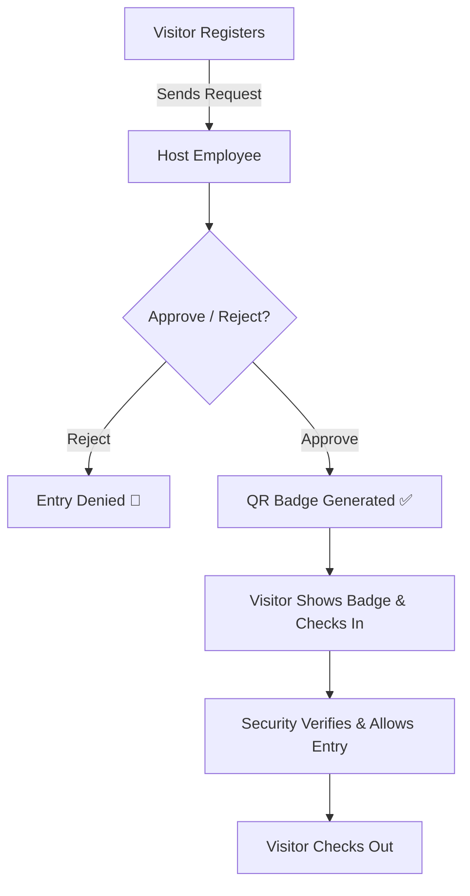
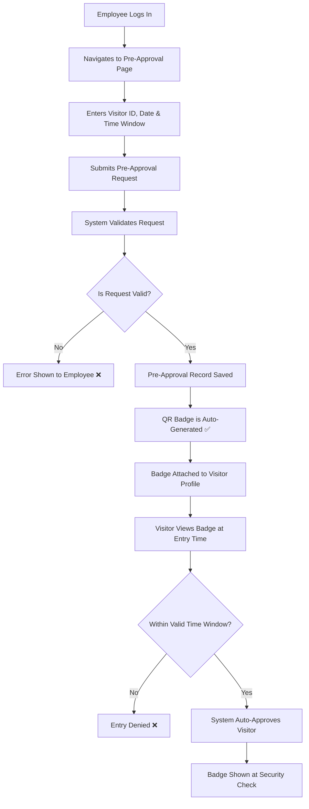

# 🛡️ Visitor Management System

A complete end-to-end **Visitor Management System** built with FastAPI + Next.js for seamless handling of real-time visitor registrations, approvals, QR-based check-ins, and automated pre-approvals.

---

## 🔐 Authentication

- Secure login for employees via JWT tokens
- Protected API routes and frontend access

---

## 📝 Features

### 1. Visitor Registration
- Visitors register via form with:
  - Full name, contact, company, purpose
  - Host employee name & department
  - Photo capture (uploaded to Cloudinary)
- Automatically triggers a **visitor approval request**
- Notification (email) sent to the host employee
- `check_in` time recorded

### 2. Approval Workflow
- Host receives **email notification** of the visitor
- Host can **Approve** or **Reject** request
- Upon approval:
  - A QR badge is generated & uploaded
  - Visitor is allowed entry
- Upon rejection:
  - Visitor is denied access

### 3. Pre-Approval System
- Employees can **pre-schedule visitor access**
- Provide:
  - Visitor ID, valid time window, max visits/day
- If visitor checks in during window:
  - Auto-approved ✅
  - Badge shown instantly (no manual steps)
  - Notification (email) sent to the visitor with attached QR badge

### 4. Badge Display & Checkout
- Visitors see badge at `/badge?id=<visitor_id>`
- Badge is QR-based and cloud-hosted
- Option to **Check Out** also available

### 5. Admin Panel for Approvals
- Employees can:
  - View all incoming requests
  - Approve/reject visitors manually
  - Schedule Pre-approvals for visitors

---

## 🧩 Tech Stack

| Layer        | Stack                         |
|--------------|-------------------------------|
| Frontend     | Next.js + Tailwind + ShadCN UI|
| Backend      | FastAPI + SQLAlchemy          |
| Database     | PostgreSQL (NeonDB)           |
| Media Upload | Cloudinary                    |
| Email Notify | SendGrid                      |
| Auth         | JWT Tokens                    |

---

## 🧭 Visitor Registration and Approval Workflow



## 🧭 Pre-approval Workflow

---

## ⚙️ Project Structure

```
├── backend/
│   ├── app/
│   │   ├── api/                 # FastAPI routes
│   │   ├── schemas/             # Pydantic schemas
│   │   ├── services/            # DB logic
│   │   ├── utils/               # QR gen, email
│   └── models.py
│   └── main.py
│
├── frontend/
│   ├── app/                     # Next.js App Router
│   ├── components/              # ShadCN UI components
│   ├── lib/                     # Auth, Axios instance
│   └── public/
```
---

## 🚀 How to Run Locally

```bash
# Backend
cd backend
cp .env.example .env
python -m venv env
source ./env/bin/activate
uvicorn app.main:app --reload

# Frontend
cd frontend
cp .env.local.example .env.local
npm install && npm run dev
```

---

## 👨‍💻 Author

**Mondi Venkata Kartikeya**  

---
