# 🛡️ Visitor Management System

A production-grade, full-stack **Visitor Management System (VMS)** built using **FastAPI**, **Next.js**, and **PostgreSQL**. Designed for enterprise-grade security, performance, and ease of use. This system manages real-time visitor flows, approvals, badge generation, and automated pre-approvals with audit logging.

---

## ✅ Key Features

### 👤 Visitor Registration
- Capture full visitor details including:
  - Full Name, Contact, Company, Purpose of Visit
  - Host Employee Name & Department
  - Live Photo Upload (Cloudinary)
- Auto-check-in timestamp recorded
- Notification sent to host employee via email
- Visitor receives badge upon approval

### ✅ Approval Workflow
- Host receives **email notification**
- Host can **Approve** or **Reject** via frontend
- Approved → QR Badge is issued
- Rejected → Access denied + security alerted

### ⚡ Pre-Approval System
- Employees can pre-approve visitor access by:
  - Specifying Visitor ID, time window, and max visits/day
- If visitor checks in during this window:
  - Auto-approved & badge issued instantly
- Visitor can view badge without waiting for approval

### 🧾 Badge Display & Checkout
- Visitors can view badge at `/badge?id=<visitor_id>`
- Badge includes:
  - QR Code (Cloudinary hosted)
  - Visit metadata
- Option to self check-out with timestamp logging

### 📋 Admin/Employee Panel
- View incoming visitor requests
- Approve or Reject with one click
- Create Pre-Approvals
- View Approval History

---

## 🧠 Evaluation Criteria Coverage

### 1. Authentication
- JWT-based secure authentication for employees
- Access control over protected routes

### 2. Cost Estimation - Time & Space
- FastAPI + PostgreSQL for minimal latency & memory footprint
- Async DB calls and indexes used for efficient lookup

### 3. System Failure Handling
- Exception handling on all endpoints
- DB rollback on failure + retry patterns in QR/email upload
- Fallback messages for system users

### 4. Object-Oriented Programming (OOPS)
- Modular Python backend using classes/services
- Encapsulation via services layer for business logic
- Pydantic models for structured data validation

### 5. Trade-offs
- Cloudinary used over local storage for scalability
- SendGrid used over SMTP for reliability & speed

### 6. System Monitoring
- Logging using Python `logging`
- SQLAlchemy query logs visible for DB tracing

### 7. Error & Exception Handling
- Meaningful error responses via FastAPI exception hooks
- DB commit wrapped in try-catch with rollback safety
- Validation errors surfaced clearly to frontend

---

## 🧭 Visitor Registration and Approval Workflow

```mermaid
graph TD
    A[Visitor Registers] -->|Sends Request| B[Host Employee]
    B --> C{Approve / Reject?}
    C -->|Reject| D[Entry Denied 🚫]
    C -->|Approve| E[QR Badge Generated ✅]
    E --> F[Visitor Shows Badge & Checks In]
    F --> G[Security Verifies & Allows Entry]
    G --> H[Visitor Checks Out]
```



## ⏳ Pre-Approval Workflow

```mermaid
graph TD
    A[Employee Logs In] --> B[Navigates to Pre-Approval Page]
    B --> C[Enters Visitor ID, Date & Time Window]
    C --> D[Submits Pre-Approval Request]
    D --> E[System Validates Request]
    E --> F{Is Request Valid?}
    F -->|No| G[Error Shown to Employee ❌]
    F -->|Yes| H[Pre-Approval Record Saved]
    H --> I[QR Badge is Auto-Generated ✅]
    I --> J[Badge Attached to Visitor Profile]
    J --> K[Visitor Views Badge at Entry Time]
    K --> L{Within Valid Time Window?}
    L -->|No| M[Entry Denied ❌]
    L -->|Yes| N[System Auto-Approves Visitor]
    N --> O[Badge Shown at Security Check]
```



---

## 🧩 Tech Stack

| Layer        | Stack                         |
|--------------|-------------------------------|
| Frontend     | Next.js + Tailwind + ShadCN UI|
| Backend      | FastAPI + SQLAlchemy          |
| Database     | PostgreSQL (NeonDB)           |
| Media Upload | Cloudinary                    |
| Email Notify | SendGrid                      |
| Auth         | JWT Tokens                    |

---

## ⚙️ Project Structure

```
├── backend/
│   ├── app/
│   │   ├── api/                 # FastAPI routes
│   │   ├── schemas/             # Pydantic schemas
│   │   ├── services/            # Business logic
│   │   ├── utils/               # QR gen, email, file tools
│   │   ├── core/                # Settings & config
│   │   ├── models.py
│   │   └── main.py              # FastAPI app instance
│
├── frontend/
│   ├── app/                     # Next.js App Router
│   ├── components/              # UI components (ShadCN)
│   ├── lib/                     # Auth, Axios
│   └── public/                  # Static assets
```

---

## 🚀 How to Run Locally

```bash
# Backend
cd backend
cp .env.example .env
python -m venv env
source ./env/bin/activate
pip install -r requirements.txt
uvicorn app.main:app --reload

# Frontend
cd frontend
cp .env.local.example .env.local
npm install && npm run dev
```

---

## 👨‍💻 Author

**Mondi Venkata Kartikeya**  
- Email: kaartimondi@gmail.com
- GitHub: [github.com/Kaarti22](https://github.com/Kaarti22)  
- LinkedIn: [linkedin.com/in/kartikeya-mondi](https://www.linkedin.com/in/kartikeya-mondi-1b429325a/)

---
